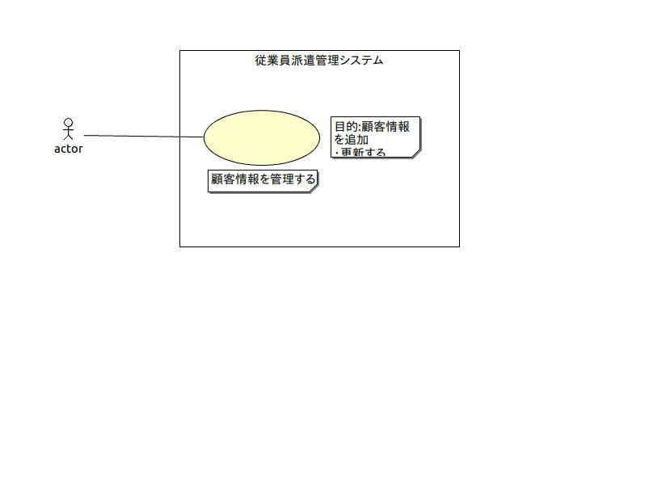

# 顧客情報の管理

# 1.概要
従業員管理システムにおいて顧客情報の追加や更新ができるように
機能の追加・変更を行う

# 2.ユースケース図

## 3.イベントフロー
1. メインフロー
このユースケースは、オペレーターが「顧客管理」を選択することから
始まり、選択された機能コードにより、以下の処理に別れる
	1. 「追加」の機能コード(CI)が選択された場合
	　 オペレーターが顧客情報を入力すると、システムは入力された顧客情報に
	   顧客マスターに登録されている最大の顧客IDに1を加えた顧客IDを割り当てて
	   顧客マスターに登録し、割り当てられた顧客IDを画面に表示する
	1. 「更新」の機能コード(CU)が選択された場合
	   オペレーターが顧客IDを指定すると、システムは該当する顧客情報を顧客
	   マスターから取り出して表示する、オペレーターが更新する項目番号と更新値
	   を入力すると、システムは入力された値で顧客マスターを更新する

##4.シーケンス図

###4.1 「顧客を管理する」のシーケンス図

###4.1.1 「追加」のコードが選択された場合

###4.1.2 「更新」のコードが選択された場合

##5.クラス図

### 5.1 クラスの概要
|クラス名|概要|
|:-------|:---|
|SystemManager|従業員派遣管理メインクラス|
|Client|顧客マスターファイルレコードを表す|
|ClientList|顧客マスターファイルのレコードをまとめたリストを表す|
|AddClientStatus|顧客管理の「追加」処理を行う|
|UpdateClientStatus|顧客管理の「更新」処理を行う|

### 5.2 システムのクラス図

## 6.メソッド一覧

### 6.1 クラス SystemManager
|NO.|メソッド名|処理名|変更箇所|
|:-:|:---------|:-----|:-------|
|1|main|メインメソッド|PersonList => ClientList|
|2|statusSetting|システムの状態の設定|メインメニューに顧客管理を追加 
顧客情報の追加ステータスを生成 
顧客情報の更新ステータスを生成

### 6.2 クラス AddClientStatus
|NO.|メソッド名|処理名|変更箇所|
|:-:|:---------|:-----|:-------|
|1|setNextStatus|次に遷移する状態及びコマンドの文字列の設定|処理名|変更箇所
|2|getNextStatus|次に遷移する状態の取得
|3|displayFirstMess|最初に出力するメッセージの表示
|4|displayPromptMess|次の状態に遷移することを促すためのメッセージ
の表示|
|5|displayFirstMess|操作者からのキー入力受付|

### 6.3 クラス UpdateClientStatus
|NO.|メソッド名|処理名|変更箇所|
|:-:|:---------|:-----|:-------|
|1|setNextStatus|次に遷移する状態及びコマンドの文字列の設定|処理名|変更箇所
|2|getNextStatus|次に遷移する状態の取得
|3|displayFirstMess|最初に出力するメッセージの表示
|4|displayPromptMess|次の状態に遷移することを促すためのメッセージ
の表示|
|5|displayFirstMess|操作者からのキー入力受付|

### 7. ファイル
顧客管理からは顧客マスター(client.csv)のみ追加/更新
-顧客マスタ(client.csv)
	-顧客ID
	-会社名
	-住所
	-電話番号
	-削除フラグ

## 8. システムの状態遷移図

## 9. 画面イメージ

### 9.1 機能を選択する

### 9.2 顧客を管理する

### 9.2.1 「追加」コードが選択された場合

### 9.2.2 「更新」コードが選択された場合

